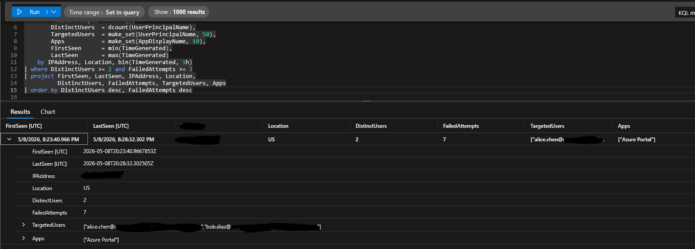

# Entra ID Threat Hunting Pack

A small, growing collection of KQL hunting queries for detecting identity-layer threats in Microsoft Entra ID (Azure AD), runnable in **Microsoft Sentinel** and adaptable to **Microsoft Defender XDR Advanced Hunting**.

Each query is mapped to MITRE ATT&CK, includes a description of the attacker behavior it surfaces, common false-positive sources, and references to the underlying Microsoft documentation.

## Why this exists

Identity is the new perimeter. The vast majority of cloud breaches in recent years have started with credential abuse, illicit consent grants, or token theft against Entra ID — not with traditional endpoint or network compromise. This repo is a study notebook and starter kit for hunting those threats.

## Coverage

| # | Detection | MITRE ATT&CK | Data Source |
|---|---|---|---|
| 01 | Password spray from a single IP | T1110.003 | `SigninLogs` |
| 02 | Risky sign-ins flagged by Identity Protection | T1078.004 | `SigninLogs` |
| 03 | Illicit OAuth consent grant | T1528 | `AuditLogs` |
| 04 | Privileged role assignment | T1098.003 / T1078.004 | `AuditLogs` |
| 05 | Successful legacy authentication | T1078.004 | `SigninLogs` |
| 06 | MFA method tampering by another user | T1556.006 | `AuditLogs` |


## Validated detections

The password spray detection has been exercised end-to-end in an Entra ID lab tenant — test users, seeded failed sign-ins from a single IP, and the query returning the expected attack signature.



Result: 2 distinct users targeted, 7 failed authentication attempts from one source IP within the same hour window — matches T1110.003 (Brute Force: Password Spraying). Source IP and tenant domain are redacted.


## Requirements

You can build a free lab in minutes:
1. Sign up for the [free Azure tier](https://azure.microsoft.com/free/).
2. In Microsoft Entra ID, configure **Diagnostic settings** to send `SignInLogs` and `AuditLogs` to a Log Analytics workspace.
3. Create a few test users in your `*.onmicrosoft.com` domain and seed sign-in activity.
4. Paste any query from `/queries` into the workspace's Logs blade and run.
## How to use

- Start with default lookback windows; tune `ago(...)` and thresholds to your environment.
- Treat every result as a *lead*, not a verdict — read the false-positives section in each query header before escalating.
- For Defender XDR Advanced Hunting, the table names differ (`AADSignInEventsBeta`, `IdentityLogonEvents`, etc.) but the field semantics are nearly identical; porting is straightforward.

## Repository structure

```
entra-id-hunting-pack/
├── README.md
├── LICENSE
├── CONTRIBUTING.md
└── queries/
    ├── 01-password-spray.kql
    ├── 02-risky-signins.kql
    ├── 03-illicit-oauth-consent.kql
    ├── 04-privileged-role-assignment.kql
    ├── 05-legacy-auth-success.kql
    └── 06-mfa-method-tampering.kql
```

## Roadmap

- Sigma rule equivalents for SIEM-agnostic deployment
- Defender XDR Advanced Hunting variants alongside each Sentinel query
- Conditional Access policy-as-code companion repo
- Automated tuning notebook (Jupyter + KQL magic) for baselining thresholds per tenant

## License

MIT — see [LICENSE](LICENSE).
